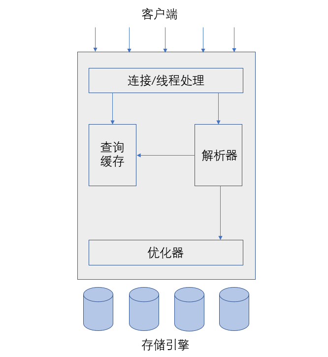

[TOC]


## 1.MySQL逻辑架



### 1.第一层架构

这一层的服务并不是MySQL独有的，大多数基于网络的客户端/服务器的工具或者服务都有类似的架构。比如连接处理、授权认证、安全等等。

### 2.第二层架构

大多数MySQL的核心服务功能都在这一层，包括查询解析、分析、优化、缓存以及所有的内置函数（例如，日期、时间、数学和加密函数），所有跨存储引擎的功能都在这一层实现：存储过程、触发器、视图等等。

### 3.第三层架构

这一层包含了存储引擎。存储引擎负责MySQL中数据的存储和提取。和GPU/Linux下的各种文件系统一样，每个存储引擎都有它的优势和劣势。服务器通过API与存储引擎进行通信。这些接口屏蔽了不同存储引擎之间的差异。存储引擎API包含几十个底层函数，用于执行诸如“开始一个事务”或者“根据主键提取一行记录”等操作。但存储引擎不会去解析SQL（除了InnoDB会解析外键定义，因为MySQL服务器本身没有实现该功能），不同存储引擎之间也不会互相通信，而只是简单地响应上层服务器的请求。

## 2.并发控制（共享锁与排他锁）

无论何时，只要有多个查询需要在同一时刻修改数据，都会产生并发控制的问题。如何解决？

在处理并发读或者写时，可以通过实现一个由两种类型的锁组成的锁系统来解决问题。这两种类型的锁通常被称为**共享锁**（shared lock）和**排他锁**（exclusive lock），也叫**读锁**（read lock）和**写锁**(write lock)。

### 1.读锁

读锁是共享的，或者说是相互不阻塞的。多个用户在同一时刻可以读取同一个资源而互不干扰。

### 2.写锁

写锁是具有排他性的，也就是说一个写锁会**阻塞其他的写锁和读锁**。这是出于安全策略的考虑，只有这样，才能确保在给定的时间里，只有一个用户能执行写入，并防止其他用户读取正在写入的同一资源。

## 3.锁粒度

一种提高共享资源并发性的方式就是让锁对象更具有选择性。尽量只锁定需要修改的部分数据，而不是所有资源。更理想的是，只对会修改的数据片进行精确的锁定。任何时候，在给定的资源上，锁定的数据量越少，则系统的并发程序越高，只要相互之间不发生冲突。

但是，加锁以及锁的各种操作也会增加系统的开销。如果系统花费大量的时间来管理锁，而不是存取数据，则性能也可能因此受影响。

因此，所谓的**锁策略**（或者说选择合适的锁粒度）就是在锁的开销和数据的安全性之间寻求平衡。大多数商业数据库系统没有提供更多的选择，一般是在表上施加行级锁，而MySQL则提供了多种选择。每种MySQL存储引擎都可以实现自己的锁策略和锁粒度。

## 4.表锁和行级锁

### 1. 表锁（table lock）

表锁是MySQL中最基本的锁策略，并且开销是最小的策略。它会锁定整张表，一个用户在对表进行写操作（插入、删除、更新等）前，需要先获得写锁，这会**阻塞**其他用户对该表的所有读写操作。只有没有写锁时，其他读取的用户才能获得读锁，读锁之间是不相互阻塞的。

在特定的场景中，表锁也可能有良好的性能。例如，READ LOCAL表锁支持某些类型的并发写操作。

尽管存储引擎可以管理自己的锁，MySQL本身还是会使用各种有效的表锁来实现不同的目的。例如，服务器会为诸如ALTER TABLE之类的语句使用表锁，而忽略存储引擎的锁机制。

### 2.行级锁（row lock）

行级锁可以最大程度地支持并发处理（但同时也带来了最大的锁开销）。在InnoDB和XtraDB以及其他一些存储引擎中实现了行级锁。行级锁只在存储引擎层实现，而MySQL服务器层没有实现，服务器层完全不了解存储引擎中的锁实现。

## 5.事务

事务就是一组原子性的SQL查询，或者说一个独立的工作单元。事务内的语句，要么全部执行成功，要么全部执行失败。

例如一个银行的数据库有两张表：支票checking表和储蓄savings表。现在要从用户Jane的支票账户转移200美元到她的储蓄账户，那么需要至少三个步骤：

1. 检查支票账户的余额高于200美元
2. 从支票账户余额中减去200美元
3. 在储蓄账户余额中增加200美元

上述三个步骤必须打包在一个事务中，任何一个步骤失败，则必须回滚所有的步骤。

可以使用START TRANSACTION语句开始一个事务，然后要么使用COMMIT提交事务将修改的数据持久保留，要么使用ROLLBACK撤销所有的修改。事务SQL样本如下：

```sql
start transaction;
select balance from checking where customer_id=1201201;
update checking set balance = balance - 200.00 where customer_id=1201201;
update savings set balance = balance + 200.00 where customer_id=1201201；
commit;
```

但是，如果执行到第四条语句时服务器崩溃或者执行到第三条语句和第四条语句之间时，另外一个进程要删除支票账户的所余额，那么结果都不对。

除非，系统通过严格的ACID测试，否则事务就是空谈。

## 6.ACID

### 1. 原子性（atomicity）

一个事务必须被视为一个不可分割的最小工作单元，整个事务中的所有操作要么全部提交成功，要么全部失败回滚，对于一个事务来说，不可能只执行其中的一部分操作。

### 2.一致性（consistency）

数据库总是从一个一致性的状态转换到另外一个一致性的状态。

在前面的例子中，一致性确保了，即使在执行第三、四条语句之间时系统崩溃，支票账户也不会损失200美元，因为事务最终没有提交，所以十五章所做的修改也不会保存到数据库中。

### 3.隔离性（isolation）

通常来说，一个事务所做的修改在最终提交以前，对其他事务是不可见的。

在前面的例子中，当执行完第三条语句、第四条语句还未开始时，此时有另外一个账户汇总程序开始运行，则其看到的支票账户的余额并没有被减去200美元。后面讨论隔离级别（isolation）时可以知道此处为什么说通常来说。

### 4.持久性（durability）

一旦事务提交，则其所做的修改就会永久保存到数据库中。此时即使系统崩溃，修改的数据也不会丢失。

持久性是个模糊的概念，因为实际上持久性也分很多不同的级别。有些持久性策略能够提供非常强的安全保，有些则未必，而且不可能有能做到100%的持久性保证的策略（如果数据库本身就能做到真正的持久性，那么备份又怎么能增加持久性呢？）。

## 7.隔离级别

隔离性其实比想象的要复杂，在SQL标准中定义了四种隔离级别。每一种级别都规定了一个事务中所做的修改，哪些事务内核事务间是可见的，哪些是不可见的。

较低级别的隔离通常可以执行更高的并发，系统的开销也更低。

### 1.READ UNCOMMITTED（未提交读）

该级别中，事务中的修改，即使没有提交，对其他事务也都是可见的。事务可以读取未提交的数据。这也被称为**脏读**（Dirty Read）。

这个级别会导致很多问题，从性能上来说，READ UNCOMMITTED不会比其他的级别好太多，但却缺乏其他级别的很多好处，除非真的有非常必要的理由，在实际应用中一般很少使用。

### 2.READ COMMITTED（提交读）

该级别中，一个事务开始时，只能“看见”已经提交的事务所做的修改。换句话说，一个事务从开始直到提交之前，所做的任何修改对其他事务都是不可见的。这个级别有时候也叫做不可重复读（nonrepeatable read），因为两次执行同样的查询，可能会得到不一样的结果。

这是大多数数据库系统的默认隔离级别，但MySQL不是。

### 3.REPEATABLE READ（可重复读）

该级别保证了在同一个事务中多次读取读取同样记录的结果是一致的。

该级别解决了脏读的问题，但是理论上，可重复读隔离级别还是无法解决另外一个**幻读**（Phantom Read）的问题。

**可重复读是MySQL的默认事务隔离级别。**

#### 幻读

指的是当某个事务在读取某个范围内的记录时，另外一个事务又在该范围内插入了新的记录，当之前的事务再次读取该范围的记录时，会产生**幻行**（Phantom Row）。InnoDB和XtraDB存储引擎通过多版本并发控制（MVVC，Multiversion Concurrency Control）解决了幻读的问题。

### 4.SERIALIZABLE（可串行化）

该级别是最高的隔离级别，它通过强制事务串行执行，避免了前面说的幻读问题。简单来说，该级别会在读取的每一行数据上都加锁，所以可能导致大量的超时和锁争用的问题。

实际应用中很少使用该隔离级别，只有在非常需要确保数据的一致性而且可以接受没有并发的情况下，才考虑采用该级别。

| 隔离级别         | 脏读可能性 | 不可重复读可能性 | 幻读可能性 | 加锁读 |
| ---------------- | ---------- | ---------------- | ---------- | ------ |
| READ UNCOMMITTED | 是         | 是               | 是         | 否     |
| READ COMMITTED   | 否         | 是               | 是         | 否     |
| REPEATABLE READ  | 否         | 否               | 是         | 否     |
| SERIALIZABLE     | 否         | 否               | 否         | 是     |

## 8.死锁

死锁指两个或者多个事务在同一资源上互相占用，并请求锁定对方占用的资源，从而导致恶性循环的现象。

当多个事务试图以不同的顺序锁定资源时，就可能产生死锁。多个事务同时锁定同一个资源时，也会产生死锁。

例如，下面两个事务同时处理StockPrice表就有可能产生死锁。

事务1

```sql
start transaction;
update StockPrice set close = 45.50 where stock_id = 4 and date = '2002-05-01';
update StockPrice set close = 19.80 where stock_id = 3 and date = '2002-05-02';
commit;
```

事务2

```sql
start transaction;
update StockPrice set high = 20.12 where stock_id = 3 and date = '2002-05-02';
update StockPrice set high = 47.20 where stock_id = 4 and date = '2002-05-01';
commit;
```

为了解决这种问题，数据库系统实现了各种**死锁检测**和**死锁超时**机制。比如InnoDB存储引擎能检测到死锁的循环依赖，并立即返回一个错误，这种方式很有效。还有一种解决方式，就是当查询的时间达到锁等待超时的设定后放弃锁请求，这种方式通常来说不太好。InnoDB目前处理死锁的方法是：将持有最少行级排他锁的事务进行回滚。（这是相对比较简单的死锁回滚算法）。

## 9.MySQL中的事务

### 1.自动提交（AUTOCOMMIT）

MySQL默认采用自动提交模式。也就是说，如果不是显式地开始一个事务，则每个查询都被当作一个事务执行提交操作。在当前连接中，可以通过设置AUTOCOMMIT变量来启用（0/ON）或禁用（1/OFF）自动提交模式。当启用时，所有的查询都是在一个事务中，直到显式地执行COMMIT提交或者ROLLBACK回滚，该事务结束，同时又开始了另一个新事务。修改AUTOCOMMIT对非事务型的表，比如MyISAM或者内存表，不会有任何影响。

另外还有一些命令，在执行之前会强制执行COMMIT提交当前的活动事务。如在数据定义语言（DDL）中，如果是会导致大量数据改变的操作，比如ALTER TABLE，还有LOCK TABLES等就是如此。

MySQL可以通过执行set transaction isolation level命令来设置隔离级别。

MySQL能够识别所有的4个ANSI隔离级别，InnoDB引擎也支持所有的隔离级别。

### 2.在事务中混合使用存储引擎

MySQL服务器层不管理事务，事务是由下层的存储引擎实现的，所以在同一个事务中，使用多种存储引擎是不可靠的。

如果在事务中混合使用了事务型和非事务型的表（例如InnoDB和MyISAM表），在正常提交的情况下没有问题，但如果该事务需要回滚，非事务型的表上的变更就无法撤销，这会导致数据库处于不一致的状态，这种情况很难修复，事务的最终结果将无法确定。因此，为每张表选择合适的存储引擎非常重要。

## 10.多版本并发控制MVCC

MySQL的大多数事务型存储引擎实现的都不是简单的行级锁。基于提升并发性能的考虑，它们一般都同时实现了多版本并发控制（MVCC）。其他数据库系统如Oracle等等也实现了MVCC，但各自的实现机制不尽相同。

MVCC，可以认为是行级锁的一个变种，但是它在很多情况下避免了加锁操作，因此开销更低。虽然实现机制有所不同，但大都实现了非阻塞的读操作，也操作也只锁定必要的行。

### 1.MVCC的实现

通过保存数据在某个时间点的快照来实现的。也就是是说，不管需要执行多长时间，每个事物看到的数据都是一致的。根据事务开始的时间不同，每个事务对同一张表，同一时刻看到的数据可能是不一样的。不同存储引擎的MVCC实现是不同的，典型的有**乐观并发控制**和**悲观并发控制**。

### 2.InnoDB的MVCC工作流程

原理：InnoDB的MVCC是通过在每行记录后面保存两个隐藏的列来实现的。这两个列，一个保存 了行的创建时间，一个保存行的过期时间（或删除时间）。当然存储的不是实际的时间值，而是**系统版本号**（system version number）。每开始一个新的事务，版本号就会自动递增。事务开始时刻的系统版本号会作为**事务的版本号**，用来和查询到的每行记录的版本号进行比较。

下面看一下在REPEATABLE READ隔离级别下，MVCC具体是如何工作的。

- select

  InnoDB会根据以下两个条件检查每行记录，只有符合这两个条件的记录，才能返回作为查询结果。

  1. 只查找早于当前事务版本的数据行（行的系统版本号小于或等于事务的系统版本号），这样可以确保事务读取的行，要么是在事务开始已经存在的，要么是事务自身插入或者修改过的。
  2. 行的删除版本要么未定义，要么大于当前事务版本号。这样可以确保事务读取到的行，在事务开始之前未被删除。

- insert

  InnoDB为新插入的每一行保存当前系统版本号作为行版本号。

- delete

  InnoDB为删除的每一行保存当前系统版本号作为行删除标识。

- update

  InnoDB为插入一行新记录，保存当前系统版本号作为行版本号，同时保存当前系统版本号到原来的行作为删除标识。

保存这两个额外的版本号，使大多数读操作都可以不用加锁。

优点：使得读数据操作很简单，性能很好，并且也能保证只会读取到符合标准的行。

缺点：每行记录都需要额外的存储空间，需要做更多的行检查工作以及一些额外的维护工作。

MVCC只在REPEATABLE READ和READ COMMITED两个隔离级别下工作，其他两个级别和MVCC不兼容。因为READ UNCOMMITTED总是读取最新的数据行，而不是符合当前事务版本的数据行，而SERIALIABLE则会对所有读取的行都加锁。

## 11.MySQL的存储引擎

### 1.InnoDB存储引擎

InnoDB是MySQL的默认事务型引擎，也是使用最广泛的存储引擎。它被设计用来处理大量的短期（short-lived）事务，短期事务大部分情况是正常提交的，很少会被回滚。InnoDB的性能和自动崩溃恢复特性，使得它在非事务型存储的需求中也很流行。因此，除非非常特别的原因需要使用其他的存储引擎才使用其他的。

1. **数据存储在表空间（tablespace）中**。

   表空间时由一系列的数据文件组成。在MySQL 4.1以后的版本中，InnoDB可以将每个表的数据和索引存放在单独文件中。

2. **采用MVCC来支持高并发，并且实现了四个标准的隔离级别。**

   默认级别是REPEATABLE READ（可重复读），并且通过**间隙锁**（next-key locking）策略防止幻读的出现。间隙锁使得InnoDB不仅仅锁定查询涉及的行，还会对索引中的间隙进行锁定，以防止幻影行的插入。

3. **基于聚簇索引建立。**

   InnoDB的索引结构和MySQL的其他存储引擎有很大的不同，聚簇索引对主键查询有很高的性能。不过它的二级索引（secondary index，非主键索引）中必须包含主键列，所以如果主键列很大的话，其他的所有索引都会很大。因此，若表上的索引较多的话，主键应当尽可能的小。

4. **InnoDB内部做了很多优化。**

   包括从磁盘读取数据时采用的可预测性预读，能够自动在内存中创建hash索引以加速读操作的自适应哈希索引（adaptive hash index），以及能够加速插入操作的插入缓冲区（insert buffer）等。

5. **作为事务型的存储引擎，InnoDB通过一些机制和工具支持真正的热备份。**

   MySQL的其他存储引擎不支持热备份，要获取一致性视图需要停止对所有表的写入，而在读写混合场景中，停止写入可能也意味着停止读取。

### 2.MyISAM存储引擎

在MySQL 5.1以及之前的版本，MyISAM是默认的存储引擎。MyISAM提供了大量的特性，包括全文索引、压缩、空间函数（GIS）等，但MyISAM不支持事务和行级锁，而且崩溃后无法安全恢复。

1. 表存储在**数据文件**（.MYD文件）和**索引文件**(.MYI文件)两个文件中。

   MyISAM表可以包含动态或者静态（长度固定）行。MySQL会根据表的定义来决定采用何种行格式、MyISAM表可以存储的行记录数，一般受限于可用的磁盘空间，或者操作系统中单个文件的最大尺寸。

2. MyISAM对整张表加锁，而不是针对行。

   读取时会对需要读到的所有表加共享锁，写入时则对表加排他锁。但是在表有读取查询的同时，也可以往表中插入新的记录。（这被称为并发插入，CONCURRENT INSERT）

3. 对于MyISAM表，可以手工或者自动执行检查和修复操作。

   这里说的修改和事务恢复以及崩溃恢复是不同的概念。执行表的修复可能导致一些数据丢失，而且修复操作时非常慢的。

4. 即使是BLOB和TEXT等长字段，也可以基于前500个字符创建索引。还支持全文索引，这是一种基于分词创建的索引，可以支持更负责的查询。

5. 支持延迟更新索引建（delayed key write）

   创建MyISAM表时，可以指定DELAY_KEY_WRITE选项，在每次修改执行完成时，不会立刻将修改的索引数据写入磁盘，而是会写到内存中的键缓冲区（in-memory key buffer），只有在清理键缓冲区或者关闭表的时候才会将对应的索引块写入磁盘。可极大提高写入性能，但在数据库或者主机崩溃时会造成索引损坏，需要执行修复操作。

   ### MyISAM压缩表

   如果表在创建并导入数据以后，不会再进行修改操作，那么或许适合采用MyISAM压缩表。可减少磁盘I/O，从而提高查询性能。压缩表也支持索引，但索引是只读的。并且，压缩时表中的记录是独立压缩的，所以读取单行的时候不需要去解压整个表（甚至也不解压行所在的整个页面）。

   ### MyISAM性能

   MyISAM引擎设计简单，数据以紧密格式存储，所以在某些场景下的性能很好。

   ## 12.数据类型

   有两种类型的数字：整数（whole number）和实数（real number）。

   ### 1.整数类型

   1. tinyint:8位
   2. smallint:16位
   3. mediumint:24位
   4. int:32位
   5. bigint:64位

   整数类型有可选的unsigned属性，表示不允许负值，即无符号整数。

   我们可以决定MySQL是怎么在内存和磁盘中保存数据的，但是整数计算一般使用64位的bigint整数，即使在32位环境也是如此。（一些聚合函数例外，它们使用decimal或double进行计算）。

   MySQL可以为整数指定宽度，例如int（11）,这对大多数应用是没有意义的：它不会限制值的合法范围，只是规定了MySQL的一些交互工具如命令行客户端用来显示字符的个数。对于存储和计算来说，int（1）和int（20）是相同的。

   ### 2.实数类型

   实数是带有小数部分的数字。然而，他们不只是为了存储小数部分，也可以使用decima存储比bigint还大的整数。MySQL既支持精确类型，也支持不精确类型。

   1. float：4个字节。支持使用标准的浮点运算进行近似计算，具体还要研究所使用的平台的浮点数的具体实现。
   2. double：8个字节。支持使用标准的浮点运算进行近似计算，具体还要研究所使用的平台的浮点数的具体实现。
   3. decimal：用于存储精确的小数。在MySQL 5.0及更高版本decimal支持精确计算。MySQL 4.1以及更早版本则使用浮点运算来实现decimal的计算，在这些版本中，decimal只是一个“存储类型”。因为CPU不支持对decimal的直接计算，所以在MySQL 5.0以及更高版本中，MySQL服务器自身实现了对decimal的高精度计算。相对而言，CPU直接支持的原生浮点计算更快。

   浮点和decimal类型都可以指定精度。对于decimal列，可以指定小数点前后所允许的最大位数，这会影响列的空间消耗。MySQL 5.0和更高版本将数字打包保存到一个二进制字符串中（每4个字节存9个数字）。

   例如：decimal（18,9）小数点两边各将存储9个数字，使用了8个字节，加上小数点本身占用1个字节，一共使用了9个字节。

   浮点类型在存储同样范围的值时，通常比decimal使用更少的空间，而且计算更快。因此应该尽量只对小数进行精确计算时才使用decimal----例如存储财务数据。但在数据量比较大的时候，可以考虑使用bigint代替decimal，将需要存储的货币单元根据小数的位数乘以相应的倍数即可。假设要存储财务数据精确到万分之一分，则可以把所有金额乘以一百万，然后将结果存储在bigint里，这样可以同时避免浮点存储计算不精确和decimal精确计算代价过高的问题。

   ### 3.字符串类型

   varchar和char是两种最主要的字符串类型，其如何存储在磁盘和内存中与存储引擎的具体实现有关。以下描述基于存储引擎是InnoDB和MyISAM。

   1. varchar

      可变长字符串，它比定长类型更节省空间，如果MySQL表使用ROW_FORMAT=FIXED创建的话，每一行都会定长存储。varchar需要使用1或2个字节记录字符串的长度，若列的最大长度小于255字节，则只是用1个字节，否则使用2个字节。

      varchar可以減少存储空间，但由于行是边长的，在update时可能会使行变得比原来更长，当在页内没有更多的空间可以存储时，MyISAM会将行拆成不同的片段存储，InnoDB则需要分裂页来使行可以放进页内。

      在存储和检索时，MySQL 5.0及更高版本会保留末尾空格。InnoDB则更灵活，它可以把过长的varchar存储为blob。

      varchar适用于以下情况：

      1. 字符串的最大长度比平均长度达很多
      2. 列的更新很少，所以碎片不是问题
      3. 使用了像UTF-8这样复杂的字符集，每个字符都使用不同的字节数进行存储

   2. char

      定长字符串，存储时会删除所有的末尾空格，char值会根据需要采用空格进行填充以方便比较。但是数据如何存储取决于存储引擎。

      char适用于以下情况：

      1. 适合存储很短的字符串或者所有值都接近同一个长度。例如，用来存储密码的MD5值，因为这是一个定长的值。
      2. 对于经常变更的数据，char也比varchar更好，因为定长的char类型不容易产生碎片。
      3. 对于非常短的列，char也比varchar更省空间，因为varchar还需要1或2个额外的字节来存储字符串的长度。

   3. binary与varbinary（类似char和varchar）

      存储的是二进制字符串，但二进制字符串存储的是字节码而不是字符，填充也不一样。MySQL填充binary采用的是\0(零字节)而不是空格，在检索时也不会去掉填充值（可以会与原来的值不相等）。

   4. blob

      为存储很大的数据而设计的，采用二进制方式存储。所属家族：tinyblob、smallblob、blob、mediumblob、longblob。blob是smallblob的同义词。没有排序规则或字符集

   5. text

      为存储很大的数据而设计的，采用字符方式存储。所属家族：tinytext、smalltext、text、mediumtext、longtext。text是smalltext的同义词。有字符集和排序规则

      与其他类型不同，MySQL把每个blob和text值当做一个独立的对象处理。存储引擎在存储时通常会做特殊处理。当blob和text值太大，InnoDB会使用专门的“外部”存储区域来进行存储，此时每个值在行内需要1~4个字节存储一个指针，然后再外部存储区域存储实际的值。

      MySQL对blob和text进行排序与其他类型不同，它只对每个列的最前max_sort_length字节而不是整个字符串做排序（可指定）。MySQL不能讲blob和text列全部长度的字符串进行索引，也不能使用这些索引消除排序。

      注意：Memory引擎不支持blob和text类型，所以如果查询使用了blob或text列并且需要使用隐式临时表，将不得不使用MyISAM磁盘临时表，这将导致严重的性能开销。

   6. enum

      枚举类型，枚举列可以把一些不重复的字符串存储成一个预定义的集合。MySQL在存储枚举时非常紧凑，会根据列表值的数量压缩到一个或两个字节中。MySQL在内部会将每个值在列表中的位置保存为整数，并且在表的.frm文件中保存“数字-字符串”的映射关系。建议尽量避免使用数字作为enum枚举常量，这种双重性很容易导致混乱。枚举字段排序是按照内部存储的整数进行排序的。

      由于MySQL把每个枚举值保存为整数，并且必须进行查找才能转换为字符串。当把char/varchar列和enum列进行关联可能会比直接关联char/varchar列更慢。如果不必和varchar/char列关联，那么把某些列转换成enum更好。这也体现了一个通用的设计实践：在“查找表”时采用整数主键而避免采用基于字符串的值进行关联。

      ### 4.时间和日期

   7. datetime

      占8个字节，可存储从1001年到9999年的日期和时间，精度为秒。它把日期封装到格式为YYYYMMDDHHMMSS的整数中，与时区无关。默认情况下，MySQL以一种可排序、无歧义的格式显示datetime值，例如“2008/01/16:2237:08”，这是ANSI标准定义的日期和时间表示方法。（为什么是8个字节）

   8. timestamp

      保存了从1970年1月1日午夜（格里尼治标准时间）以来的秒数，它和unix时间戳相同，占用4个字节，只能表示从1970年到2038年。timestamp显示的值依赖于时区。因此，存储值为0的timestamp在美国东部时区显示为“1969-12-31 19:00:00”,与格林尼治时间相差5个小时。默认情况下，如果插入时没有指定第一个timestamp列的值，MySQL则设置这个列的值为当前时间（具体还要看版本）；在插入一行记录时，MySQL默认也会更新第一个timestamp列的值（除非在update语句中指定了）。最后，timestamp列默认为not null，这和其他的数据类型不一样。

      除了特殊行为之外，通常也应该尽量使用timestamp，因为空间效率更高。把unix时间戳等存储为整数值来表示时间不会带来任何收益，而且处理格式很不方便。如果需要存储比秒更小粒度的时间和日期可以使用bigint类型存储微秒级别的时间戳或者使用double存储秒之后的小数部分，或者使用MariaDB代替MySQL。

   ### 5.位数据类型

   1. bit
   2. set

## 12.设计优化原则

### 1.选择优化的数据类型

1. **一般情况下，应该尽量使用可以正确存储数据的最小数据类型**。更快，占用更小的磁盘、内存和CPU缓存。
2. **优先使用简单数据类型**。简单数据类型的操作通常需要更少的CPU周期。例如，整型比字符串操作代价更低，因为字符集和校对规则（排序规则）使字符更复杂。两个例子：一个是应该使用MySQL内建的类型而不是字符串来存储日期和时间，另外一个是应该用整型存储IP地址。
3. **尽量避免NULL**。通常情况下最好指定列为not null，除非真的需要存储null值。如果查询中包含可为null的列对MySQL来说更难优化，因为可为null的列使得索引、索引统计和值都比较复杂。

### 2.选择合适类型的标识符

1. **为标识列选择数据类型时应该选择跟关联表中的对应列一样的类型**。应为标识列很有可能在另外的表作为外键使用或者经常用于关联查询。
2. **尽量使用整数类型作为标识列**。因为标识列经常用于查找和比较，它们很快并且可以使用auto_increment。
3. **避免使用enum和set类型作为标识列**。例如，enum必须查找映射关系才能转换为字符串。enum和set列适合存储固定信息，但大部分情况下应该避免将做它们作为标识列。
4. **尽量避免使用字符串类型作为标识列**。因为它们很消耗空间，并且通常比数字类型慢很多。如果存储UUID值，则应该移除“-”符号；或者更好的做法是用unhex()函数转换uuid值为16字节的数字，并存储在一个binary(16)列中。检索时可以通过hex()函数来格式化为十六进制格式。不过，UUID()生成的值虽不均匀，但还是有一定顺序。所以还是不如递增的整数好用。

### 3.混用范式化和反范式化

思考：使用varchar（5）和varchar（200）存储‘hello’的空间开销是一样的。那么使用短的列有什么优势吗？

有很大的优势，更长的列会消耗更多的内存因为MySQL通常会分配固定大小的内存块来保存内存值，所以最好的策略是只分配真正需要的空间。

```
IPV4地址，人们经常使用varchar(15)列来存储IP地址。然而，他们实际上是32位无符号整数，而不是字符串。用小数点将地址分成四段的表示方法是为了容易阅读，所以应该用无符号整数来存储IP地址。MySQL提供了inet_aton()和inet_ntoa()函数在这两种表示方法之间转换。
```

## 13.范式与反范式

### 1.范式

在范式化的数据库中，每个实际数据会出现并且只出现一次。

优点：

1. 范式化的更新操作通常比反范式化更快。
2. 当数据较好地范式化时，就只有很少或者没有重复数据，所以只需要修改更少的数据。
3. 范式化的表通常更小，可以更好地放在内存里，所以执行操作会更快。
4. 很少冗余数据意味着检索列表数据时更少需要使用distinct或者group by语句。

缺点：

1. 范式化设计的schema通常需要联表查询，代价昂贵，还可能使一些索引策略无效。例如，。范式化可能将列存放在不同的表中，而这些列如果在一个表中本可以属于同一个索引。

### 2.反范式

在反范式化的数据库中，信息是冗余的，可能会存储在多个地方。

优点：

1. **可以很好地避免关联**。反范式化的schema因为所有的数据都在一张表中，对于大部分查询最差的情况---即使表没有索引----是全表扫描。当数据比内存大时这可能比关联要快得多，因为这样避免了随机I/O。
2. **单独的表也能使用更有效的索引策略**。

缺点：

1. 进行插入和删除操作可能发生不一致
2. 单表可能会很大

最常见的反范式化数据的方法是**复制或者缓存**，在不同的表中存储相同的特定列。在MySQL 5.0及更高版本中，可以使用触发器更新缓存值，这使得实现这样的方案变得更加简单。

### 3.混用范式化和反范式化

## 14.缓存表和汇总表

//TODO

### 1.物化视图

//TODO

### 2.计数器表

如果应用在表中保存计算器，则在更新计数器时可能碰到并发问题。计算器表在web应用中很常见。可以用这种表缓存一个用户的朋友数、文件下载次数等。创建一张独立的表存储计算器通常是个好主意，这样可使计算器表小且快。使用独立的表可以帮助避免查询缓存失效等等。

假设有一个计数器表，只有一行数据，记录网站的点击次数，网站的每次点击都会导致对计数器进行更新。

```sql
#建表
create table hit_counter(
	cnt int unsigned not null
)engine=InnoDB;

#更新
update hit_counter set cnt = cnt + 1;
```

问题：对于任何想要更新这一行的事务来说，这条记录上都有一个全局的互斥锁(mutex)。这会使得这些事务只能串行执行。

改进：为提高并发性能，可以将计数器保存在多行中，每次随机选择一行进行更新。修改如下：

```sql
#建表
create table hit_counter(
    slot tinyint unsigned not null primary key,
	cnt int unsigned not null
)engine=InnoDB;

#然预先在这张表增加100行数据。现在选择一个随机的槽（slot）进行更新：
update hit_counter set cnt = cnt + 1 where slot = RAND()*100;

#要获得统计结果，需要使用下面这样的聚合查询：
select sum(cnt) from hit_counter;
```

一个常见的需求是每隔一段时间开始一个新的计数器（如每一天）。可以这样设计：

```sql
create table daily_hit_counter(
	day date not null,
    slot tinyint unsigned not null,
    cnt int unsigned not null,
    primaray key(day,slot)
)engine=InnoDB;
```

在这个场景中，可以不用像前面一样预先生成行。而用**on duplicate key update**代替:

```sql
insert into daily_hit_counter(day,slot,cnt) values(current_date,rand()*100,1)
on duplicate key update cnt = cnt + 1;
```

如果希望减少表的行数，以避免表变得太大，可以写一个周期执行的任务，合并所有结果到0号槽，并且删除所有其他的槽：

```sql
update daily_hit_counter as c inner join (
	select day,sum(cnt) as cnt,min(slot) as mslot
    from daily_hit_conunter 
    group by day
	)as x using(day)
set c.cnt= if(c.slot=x.mslot,x.cnt,0),
	c.slot=if(c.slot=x.mslot,0,c.slot);
```

## 15.索引

索引（在MySQL中也叫做“键（key）”）是存储引擎用于快速找到记录的一种数据结构。

索引对于良好的性能非常关键，尤其是当数据量大的时候。

假如要运行下面的查询：

```sql
select first_name from sakila.actor where actor_id = 5;
```

如果在actor_id列上建有索引，则MySQL将使用该索引找到actor_id为5的行，也就是说，MySQL先在索引上按值进行查找，然后返回所有包含该值的数据行。

在MySQL中，索引是在存储引擎而不是在服务器层实现的，没有统一的索引标准，不同存储引擎的索引实现方式也不尽相同，也不是所有的存储引擎都支持所有类型的索引。

索引的优点：

1. 索引大大减少了服务器需要扫描的数据量
2. 索引可以帮助服务器避免排序和临时表
3. 索引可以将所及I/O变为顺序I/O

### 1.MySQL支持的索引类型

#### 1.B+Tree索引

//TODO

#### 2.哈希索引

哈希索引，hash index，基于哈希表实现，只有精确匹配苏呕心所有列的查询才有效。对于每一行数据，存储引擎都会对所有的索引列计算一个哈希码。哈希索引将所有的哈希码存储在索引中，同时在哈希表中保存指向每个数据行的指针。

优点：

1. 查找速度为O（1）

缺点:

1. 无法用于排序（因为哈希索存储的是哈希码）
2. 只支持精确查找，不支持部分索引列匹配查询和范围查找
3. 当哈希冲突很多时，维护索引的代价高

 **自适应哈希索引**

InnoDB有一个特殊功能叫自适应哈希索引（adaptive hash index）。当InnoDB注意到某些索引值被使用得非常频繁时，它会在内存中基于B-Tree索引之上再创建一个哈希索引，这样就让B+ Tree索引页具有哈希索引的一些优点，如快速的哈希查找。

#### 3.全文索引

全文索引查找的是文本中的关键词，而不是直接比较索引中的值。全文索引和其他积累索引的匹配方式完全不一样。全文索引更类似于搜索引擎做的事情，而不是简单的where条件匹配。

全文索引适用于match against操作，而不是普通的where条件操作。

#### 4.空间数据索引（R-Tree）

MyISAM表支持空间索引，可以用作地理数据存储。和B+ Tree索引不同，空间索引无须采用前缀查询，空间索引会从所有维护来索引数据。查询时，可以有效地使用任意维度来组合查询。

缺点：

必须使用MySQL的GIS相关函数来维护数据，而且MySQL的GIS支持并不完善，所以一般不会使用这个特性。GIS的解决方案做得比较好的是PostgreSQL和PostGIS。

### 2.高性能的索引策略

#### 1.独立的列

查询时索引列不能是表达式的一部分，也不能是函数的参数。否则，会使得无法使用已有的索引。

例如，下面的查询就无法使用actor_id列的索引：

```sql
select actor_id from sakila.actor where actor_id + 1 = 5;
```

#### 2.前缀索引和索引选择性

选择足够长的前缀以保证较高的选择性，同时由不能太长（以便节约索引空间）。对于blob、text或者很长的varchar类型的列，必须使用前缀索引，因为MySQL不允许索引这些列的完整长度。

#### 3.多列索引

在需要使用多个列作为条件查询时，使用多列索引比使用多个单列索引性能更好。例如下面的例子，最好把列film_id和actor_id设置为多列索引。

```sql
select film_id,actor_id from sakila.film_acotor where actor_id = 1 and film_id = 1;
```

在MySQL 5.0及更高版本中引入了一种**索引合并**（index merge）策略，一定程度上可以使用表上的多个单列索引来定位指定的行，这是一种优化策略，但若MySQL为你的查询使用了这个策略，更多时候也说明了你的表索引建得很糟糕。

#### 4.选择合适的索引列顺序

正确的顺序依赖于使用该索引的查询，并且同时需要考虑如何更好地满足排序和分组（针对B+ Tree索引）的需要。当不需要考虑排序和分组时，将选择性高的放在前面通常是很好的。当然，不要假设平均情况下的性能可以代表特殊情况下的性能，因此选择列顺序时不要忘了排序、分组和范围条件等其他因素，要具体问题具体分析。

#### 5.聚簇索引

聚簇索引并不是一种单独的索引类型，而是一种数据存储方式。具体的细节依赖于其实现方式，InnoDB的聚簇索引实际上在同一个结构中保存了B+ Tree索引和数据行。它的数据行实际上存放正在索引的叶子页（leaf page）中。术语“聚簇”表示数据行和相邻的键值紧凑地存储在一起。

**一个表只能有一个聚簇索引**，因为无法同时把数据行存放在两个不同的地方。（不过覆盖索引可以模拟多个聚簇索引的情况）

///TODO 聚簇索引的数据分布图（以InnoDB为例）

InnoDB将通过主键聚集数据（MySQL中所有内建的存储引擎暂不支持自定义选择），也就是说上图"被索引的列"就是主键列。如果没有定义主键，InnoDB会选择一个唯一的非空索引代替。若没有这样的索引，InnoDB会隐式定义一个主键来作为聚簇索引。InnoDB只聚集在同一个页面中的记录。包含相邻键值的页面可能会相距甚远。

聚簇索引有时对性能有帮助，有时也会导致严重的性能问题。尤其是将表的存储引擎从InnoDB改成其他引擎的时候（反之亦然）。

优点：

1. **可以把相关数据保存在一起**。例如实现电子邮箱时，可以根据用户ID来聚集数据，这样只需要从磁盘读取少数的数据页就能获取某个用户的全部邮件。如果没有使用聚簇索引，则每封邮件都可能导致一次磁盘I/O。
2. **数据访问更快**。
3. **使用覆盖索引扫描的查询可以直接使用页节点中的主键值**。

缺点：

1. 聚簇数据最大限度地提高了I/O密集型应用的性能，但如果数据全部都放在内存中，则访问的顺序就没那么重要了，聚簇索引也就没什么优势了。
2. **插入速度严重依赖于插入顺序**。按照主键的顺序插入才是加载数据到InnoDB表中速度最快的方式。
3. **更新聚簇索引列的代价很高**，因为会强制InnoDB将每个被更新的行移动到新的位置**。**
4. **可能面临页分裂（page split）问题，页分裂会导致表占用更多的磁盘空间。**。在插入新行或者主键被更新导致需要移动行的时候，若行的主键值要求必须将这一行插入到某个已满的页中时，存储引擎会将该页分裂成两个页面来容纳该行，这就是一次页分裂操作。
5. 聚簇索引可能导致全表扫描变慢，尤其是行比较稀疏，或者由于页分裂导致数据存储不连续的时候。****
6. **二级索引（非聚簇索引）可能比想象的要更大。因为在二级索引的叶子节点包含了引用行的主键列。**
7. **二级索引访问需要两次索引查询，而不是一次。**二级索引叶子节点保存的不是指向行的物理位置的指针，而是行的主键值。（二级索引中保存的“行指针”的实质）

InnoDB和MyISAM的数据分布对比图

//TODO(使用UUID而不是AUTO_INCREMENT的整数作为主键列可能导致更多的页分裂操作。)

#### 6.覆盖索引

如果一个索引包含（或者说覆盖）所有需要查询的字段的值，我们就称之为”覆盖索引“。

覆盖索引是非常有用的工具，能够极大地提高性能。因为查询只需要扫描索引而无须回表。

优点：

1. **索引条目通常远小于数据行大小，可以极大地减少数据访问量**。
2. **更少的I/O**。因为索引是按照列值顺序存储的（至少在单个页内是如此），所以对于I/O密集型的范围查询会比随机从磁盘读取每一行数据的I/O要少得多。
3. 一些存储引擎如MyISAM在内存中只缓存索引，数据则依赖于操作系统来缓存，因此要访问数据需要一次系统调用。这样可能会导致严重的性能问题。使用覆盖索引则可以避免这种问题。
4. **由于InnoDB的聚簇索引，覆盖索引对于InnoDB表特别有用**。InnoDB的二级索引在叶子节点保存了行的主键值，所以如果二级主键能够覆盖查询，则可以避免对主键索引的二次查询。

#### 7.使用索引扫描来做排序

MySQL有两种方式可以生成有序的结果：通过排序操作、按索引顺序扫描

扫描索引本身是很快的，因为只需要从一条索引记录移动到紧接着的下一条记录。但如果索引不能覆盖查询所需的全部列，那就不得不每扫描一条索引记录都回表查询一次对应的行。这基本上都是随机的I/O，因此按索引顺序读取数据的速度通常要比顺序地全表扫描慢，尤其是在I/O密集型的工作负载时。

在MySQL中，可以使用同一个索引即满足排序，又用于查找行。如果可能，设计索引时应该尽可能同时满足这两种任务，这样是最好的。

只有当索引的列顺序和order by字句的顺序完全一致，并且所有列的排序方向（倒序或正序）都一样时，MySQL才能够使用索引来对结果排序。如果查询需要关联多张表，则只有当order by字句引用的字段全部为第一个表时，才能使用索引做排序。order by字句和查找型查询的限制是一样的：需要满足索引的最左前缀的要求；否则，MySQL都需要执行排序操作，而无法利用索引排序。

有一种情况下order by子句可以不满足索引的最左前缀的要求，就是前导列为常量的时候。如果where子句或者join子句中对这些列指定了常量，就可以“弥补”索引的不足。

例如，下面的rental在列（rental_date,inventory_id,customer_id）上有名为rental_date的索引。

```sql
create table rental(
    ...
	primary key (rental_id),
    unique key rental_date (rental_date,inventory_id,customer_id),
    key idx_fk_inventory_id (inventory_id),
    key idx_fk_customer_id (customer_id),
    key idx_fk_staff_id (staff_id),
    ...
);
```

MySQL可以使用rental_date索引为下面的查询做排序，从EXplain中可以看到没有出现文件排序（filesort）操作。（注：MySQL称其为filesort，其实不一定使用磁盘文件）

```sql
explain select rental_id,staff_id from sakila.rental
where rental_date = '2005-05-25'
order by inventory_id,customer_id\G
*****************1.row***********************************
	     type:ref
possible_keys:rental_date
		  key:rental_date
		 rows:1
		Extra:Using where
```

即使order by子句不满足索引的最左前缀要求，也可以用于查询排序，这是因为索引的第一列被指定为一个常数。

下面这个查询可以利用索引排序，是因为查询为索引的第一列提供了常量条件，而使用第二列进行排序，将两列组合在一起，就形成了索引的最左前缀：

```sql
....where retal_date = '2005-05-25' order by inventory_id desc;
```

下面这个查询也没有问题，因为order by使用的两列就是索引的最左前缀。

```sql
... where rental_date > '2005-05-25' order by rental_date,inventory_id
```

#### 8.压缩（前缀压缩）索引

MyISAM使用前缀压缩来减少索引的大小，从而让更多的索引可以放入内存中，这在某些情况下能极大地提高性能。默认只压缩字符串，但可以通过参数设置对整数进行压缩。MyISAM压缩每个索引块的方法是：先完全保存索引块中的第一个值，然后将其他值和第一个值进行比较得到相同前缀的字节数和剩余不同后缀部分，把这部分存储起来即可。

例如，索引块中的第一个值是“perform”,第二个值是“performance”，那么第二个值的前缀压缩后存储的是类似“7，ance”这样的形式。MyISAM对行指针也采用类似的前缀压缩方式。

压缩快使用更少的空间，代价是某些操作可能更慢。因为每个值的压缩前缀都依赖前面的值，所以MyISAM查找时无法在索引块使用二分查找而只能从头开始扫描。正序的扫描速度还好，如果是倒序扫描----例如order by desc---就不是很好了。所有在块中查找某一行平均都需要扫描半个索引块。

#### 9.避免冗余和重复索引

重复索引：指在**相同的列**上按照相同的顺序创建的**相同类型**的索引。（不同类型如key和fulltext key不算）

冗余索引：如果创建了索引（A，B），再创建索引（A）就是冗余索引，因为这只是前一个索引的前缀索引。

因此索引（A，B）也可以当做索引（A）来使用（对于B+ Tree索引来说）。当然索引（B，A）则不是冗余索引。另外创建其他不同类型的索引（如哈希索引）也不是B+ Tree索引的冗余索引。

冗余索引通常发送在为表添加新索引的时候。例如，有人可能会增加一个新的索引（A，B）而不是扩展已有的索引（A）。还有一种情况是将一个索引扩展为（A，ID）,其中ID是主键，对于InnoDB来说主键列已经包含在二级索引中了，所以这也是冗余的。

大多数情况下都不需要冗余索引，应该尽量扩展已有的索引而不是创建新的索引，不过也有例外。

#### 10.移除未使用（永远不用）的索引

#### 11.索引和锁

索引可以让查询锁定更少的行，（即使是行锁也还是会带来额外的开销）。如果你的查询从不访问那些不需要的行，那么就会锁定更少的行。InnoDB只有在访问行的时候才会对其加锁，而索引能够减少InnoDB访问的行数。

## 16.MySQL的查询过程

### 1.查询执行路径


 

上图显示了向MySQL发送一个请求的时候，MySQL到底做了些什么？

1. 客户端发送一条查询给服务器
2. 服务器先检查查询缓存，如果命中了缓存，则立即返回存储在缓存中的结果。否则进入下一阶段。
3. 服务器进行SQL解析、预处理，再由优化器生成对应的执行计划。
4. MySQL根据优化器生成的执行计划，调用存储引擎的API来执行查询。
5. 将结果返回客户端

这只是一个简化过程，后续会看到每一阶段查询处于何种状态。查询优化器是比较复杂也比价难以理解的部分。还有很多的例外情况。如查询绑定变量后，执行路径会有所不同。

### 2.MySQL客户端/服务器通信协议

MySQL客户端和服务器端之间的通信协议是“半双工”的。这意味着，在任何一个时刻，要么是由服务器向客户端发送数据，要么是由客户端向服务器发送数据，这两个动作不能同时发生。所以，我们无法将一个消息切成小块独立发送。

优点：

**这种半双工协议让MySQL通信简单快速**

缺点：

**无法进行流量控制**。一旦一端开始发送消息，另一端要接收完整各个消息才能响应它。这也是为什么当查询的语句很长时，参数max_allowed_packet特别重要的原因。（如果查询太大，服务端会拒绝接收更多的数据并抛出相应的错误。）一旦客户端发送了请求，客户端能够做的事情就只有等待结果了。相反地，这也是为什么在必要的时候一定要在查询中加上limit限制 的原因。因为一般服务器相应给用户的数据非常多，由多个数据包组成。当服务器开始响应客户端请求时，客户端必须完整地接收整个返回结果，而不能简单地只取前面几条结果，然后让服务器停止发送数据。

### 3.MySQL查询状态

对于一个MySQL连接，或者说一个线程，任何时刻都有一个状态，该状态表示了MySQL当前正在做什么。最简单的查看当前状态的方式是使用show full processlist 命令，其返回结果中的command列就表示当前的状态。状态列表如下：

1. Sleep

   线程正在等待客户端发送新的请求。

2. Query

   线程正在执行查询或者正在将结果发送到客户端。

3. Locked

   在MySQL服务器层，该线程正在等待表锁。在存储引擎级别实现的锁，例如InnoDB的行锁，并不会体现在线程状态中。对于MyISAM来说这是一个比较典型的状态，但在其他没有行锁的引擎中也经常会出现。

4. Analyzing and statistics

   线程正在收集存储引擎的统计信息，并生成查询的执行计划。

5. Copying to tmp table [on disk]

   线程正在执行查询，并且将其结果都复制到一个临时表中，这种状态一般要么是在做group by操作，要么是文件排序（filesort)操作，或者是union操作。如果这个状态后面还有“on disk“标记，那表示MySQL正在将一个内存临时表放到磁盘上。

6. Sorting result

   线程正在对结果集进行排序。

7. Sending data

   这表示多种情况：线程可能在多个状态之间传送数据，或者在生产结果集，或者在向客户端返回数据。

### 4.查询缓存（指Query Cache）

在解析一个查询语句之前，如果查询缓存是打开的，那么MySQL会优先检查这个查询是否命中查询缓存中的数据。这个检查是通过一个对大小写敏感的哈希查找实现的，查询和缓存中的查询需要完全一样才会匹配缓存结果。

### 5.查询优化处理

查询的生命周期的下一步是将一个SQL转换成一个执行计划，MySQL再依照这个执行计划和存储引擎进行交互。这包括多个子阶段：解析SQL、预处理、优化SQL执行计划。这个过程中任何错误（如语法错误）都可能会终于查询。这里介绍其中几个独立的部分，在实际执行中，这几部分可能一起执行也可能单独执行。

#### 1.语法解析器和预处理

首先，MySQL通过关键字将SQL语句进行解析，并生成一棵对应的“解析树”。MySQL解析器将使用MySQL语法规则验证和解析查询。例如，它将验证是否使用错误的关键字，或者使用关键字的顺序是否正确等。

预处理器则根据一些MySQL规则进一步检查解析树是否合法，例如，这里将检查数据表和数据列是否存在，还会解析名字和列名，看看它们是否有歧义。

下一步预处理器会验证权限。这通常很快，除非服务器有非常多的权限配置。

#### 2.查询优化器

现在语法树被认为是合法的了，并且由优化器将其转化成执行计划。一条查询可以有很多种执行方式，最后返回相同的结果。优化器的作用是找到这其中最好的执行计划。

MySQL使用基于成本的优化器，它将尝试预测一个查询使用某种执行计划时的成本，并选择其中成本最小的一个。成本的计算随着MySQL的更新迭代变得更复杂。这是根据一系列统计信息如每个表或者索引的页面个数、索引的基数（索引中不同值的数量）、索引和数据行的长度、索引分布情况等等而计算而来的。优化器在评估成的时候并不考虑任何层面的缓存，它假设读取任何数据都需要一次磁盘I/O。

例如，当执行一次where条件比较的成本。可以通过查询当前会话的Last_query_cost的值来得知MySQL中计算的当前查询的成本。

```sql
select * from student;
+-------+-----+---------------------+
| name  | age | birthday            |
+-------+-----+---------------------+
| tiger |  21 | 1995/11/11 00:00:00 |
+-------+-----+---------------------+

show status like 'Last_query_cost';
+-----------------+----------+
| Variable_name   | Value    |
+-----------------+----------+
| Last_query_cost | 1.199000 |
+-----------------+----------+

```

有很多种原因会导致MySQL优化器选择错误的执行计划，如统计信息不准确。MySQL依赖存储引擎提供的统计信息来评估成本，但不是所有的存储引擎都能够提供准确的统计信息。例如，InnoDB因为其MVCC的架构，并不能维护一个数据表的行数的精确统计信息。

下面是一些MySQL能够处理的优化类型：

1. **重新定义关联表的顺序**

   数据表的关联并不总是按照在查询中指定的顺序进行，决定关联的顺序是优化器很重要的一部分功能。

2. **将外连接转化成内连接**

   并不是所有的outer join都必须以外连接的方式进行。诸多因素，例如where条件、库表结构都可能让外连接等价于一个内连接。 

3. **使用等价变换规则**

   MySQL可以使用一些等价变换来简化并规范表达式。它可以合并和减少一些比较，还可以移除一些恒成立和一些恒不成立的判断。例如,（5=5 and a > 5）将被改写为a > 5。类似的，（a<b and b=c）and a = 5将会被改写为b>5 and b=c and a= 5。

4. **优化count()、min()和max()**

   索引和列是否为空通常可以帮助MySQL优化这类表达式。例如，要找某一列的最小值，只需要查询对应B+ Tree索引最左端的记录，MySQL可以直接获取索引的第一行记录。在B+ Tree索引中，优化器会将这个表达式作为一个常数对待。（最大值也是类似）如果MySQL使用了这种类型的优化，那么再Explain中就可以看到"select tables optimized away"。表示优化器已经从执行计划中移除了该表，并以一个常数取而代之。类似的，没有任何where条件的count(*)查询通常也可以使用存储引擎提供的一些优化（例如，MyISAM维护了一个变量来存放数据表的行数。）

5. **预估并转化为常数表达式**

   当MySQL检测到一个表达式可以转化为常数的时候，就会一直把该表达式作为常数进行优化处理。

6. **覆盖索引扫描**

   当索引中的列包含所有查询中需要使用的列的时候，MySQL就可以使用索引返回需要的数据，而无需查询对应的数据行。

7. **子查询优化**

   MySQL在某些情况可以将子查询转换成一种效率更高的形式，从而减少多个查询多次对数据进行访问。

8. **提前终止查询**

   在发现已经满足查询需求的时候，MySQL总是能够立刻终止查询。一个典型的例子就是当使用了limit子句的时候。除此之外，下面的例子在查询优化阶段就已经终止。

   ```sql
   mysql> explain select pid from product where pid = -1;
   +----+-----+-----------------------------------------------------+
   | id | ... | Extra												 |
   +----+-----+-----------------------------------------------------+
   | 1  | ... | Impossible WHERE noticed after reading const tables |
   +----+-----+-----------------------------------------------------+
   ```

9. **等值传播**

   如果两个列的值通过等式关联，那么MySQL能够把其中一个列的where条件传递到另一个列上。例如，下面的查询

   ```sql
   select film.film_id from sakila.film inner join sakila.film_acotor using(film_id)
   where film.film_id > 500;
   ```

   因为这里使用了film_id字段进行等值关联，MySQL知道这里的where子句不仅使用与film表，而且对film_actor表同样适用。如果使用的是其他的数据管理系统，可能还需要手动通过一些条件来告知优化器这个where条件适用于两个表，那么写法就会如下：

   ```sql
   ...where film.film_id > 500 and film_actor.film_id > 500;
   ```

   在MySQL中这是不必要的，这样写反而会让查询更难维护。

10. **列表in()的比较**

    在很多数据库系统，in()完全等同于多个or条件的子句，因为这两者是完全等价的。在MySQL中则不是，MySQL将in()列表中的数据先进行排序，然后通过二分查找的方式来确定列表中的值是否满足条件，这是一个O（log n）复杂度的操作，等价地转换成or查询的复杂度为O（n），对于in（）列表中有大量取值的时候，MySQL的处理速度将会更快。

上面列举的远不是MySQL优化器的全部，我们应该学到不要自以为比优化器更聪明，而是应该让优化器按照它的方式工作，否则可能不但收益为0，还可能是查询变得更加复杂和难以维护。

#### 3.排序优化

1. **文件排序**

   MySQL优先通过索引进行排序。当不能使用索引生成排序结果的时候，MySQL需要自己排序，如果数据量小则在内存中进行，如果数据量大则需要使用磁盘，但MySQL将这个过程统称为文件排序，使用完全是内存排序不需要任何磁盘文件时也是如此。

   如果需要排序的数据量小于“排序缓冲区”，MySQL使用内存进行“快速排序”操作。否则，MySQL会先将数据分块，对每个独立的块使用“快速排序”进行排序，并将各个块的排序结果存放在磁盘上，然后将各个排好序的块进行合并（merge），最后返回排序结果。

2. **MySQL的两种排序算法**

   1. 两次传输排序（旧版本使用）

      读取行指针和需要排序的字段，对其进行排序，然后再根据排序结果读取所需要的数据行。

      优点：在排序时需要存储的数据少，可让“排序缓冲区”容纳更多的行数。

      缺点：

      1. 需要两次数据传输，会产生大量I/O。
      2. 当使用的是MyISAM表时成本更高，因为MyISAM非常依赖操作系统对数据的缓存。

   2. 单次传输排序（新版本使用）

      先读取查询所需要的所有列，然后再根据给定列进行排序，最后直接返回排序结果。

      优点：只需要一次顺序I/O读取所需数据，无须任何随机I/O。对于I/O密集型应用效率提高很多。

      缺点：如果需要返回的列非常多、非常大，会额外占用大量的空间，所以可能会有更多的排序块需要合并。

## 17.分区表

对用户来说，分区表是一个独立的逻辑表，但是底层由多个物理子表组成。实现分区的代码实际上是对一组底层表的句柄对象（Handler Object）的封装。对分区表的请求，都会通过句柄对象转换成对存储引擎的接口调用。所以分区对于SQL层来说是一个完全封装底层的黑盒子，对应用是透明的，但是从底层的文件系统来看，每一个分区表都有一个使用#分隔命名的表文件。

MySQL在创建表时使用partition by子句定义每个分区存放的数据。在执行查询的时候，优化器会根据分区定义过滤那些没有我们需要数据的分区，这样查询就无须扫描所有分区，只需查找包含需要数据的分区即可。

### 1.分区表的适用场景

1. 表非常大以至于无法全部都放在内存中，或者只在表的最后部分有热点数据，其他均是历史数据。
2. 分区表的数据更容易维护。我们可以对一个独立的分区进行删除、优化、检查、修复等操作。
3. 分区表的数据可以分布在不同的物理设备上，从而高效利用多个硬件设备。
4. 可以使用分区表来避免某些特殊的瓶颈，例如InnoDB的单个索引的互斥访问、ext3文件系统的inode锁竞争等。
5. 可以备份和恢复独立的分区。

### 2.分区表的限制

1. 一个表最多只能有1024个分区。
2. 在MySQL 5.1中，分区表达式必须是整数，或者是返回整数的表达式。在MySQL 5.5中，某些场景可以直接使用列来进行分区。
3. 如果分区字段中有主键或者唯一索引的列，那么所有主键列和唯一索引都必须包含进来。
4. 分区表中无法使用外键约束。

### 3.分区表的创建

MySQL支持多种分区表。最常见的是根据范围进行分区，每个分区存储落在某个范围的记录，分区表达式可以是列，也可以是包含列的表达式。

例如，下表就可以将每一年的销售额存放在不同的分区里。

```sql
create table sales(
	order_date datetime not null,
    ....
)engine=InnoDB partition by range(year(order_date))
(
	partition p_2010 values less than (2010),
    partition p_2011 values less than (2011),
    partition p_2012 values less than (2012),
    partition p_catchall values less than maxvalue
);
```

partition分区子句中可以使用各种函数。但有一个要求，表达式返回的值要是一个确定的整数，且不能是一个常数。这里使用了year(),也可以使用其他函数，如to_days()。根据时间间隔进行分区，是一种很常见的分区方式。

## 18.复制

### 1. 概述

复制解决的基本问题是让一台服务器的数据与其他服务器保持同步。一台主库的数据可以同步到多台备库上，备库本身也可以被配置成另外一台服务器的主库。主库和备库之间可以有多种不同的组合方式。

### 2.MySQL的两种复制方式

MySQL支持两种复制方式：**基于语句的复制**、**基于行的复制**。这两种方式都是通过在主库上记录二进制日志、在备库重放日志的方式来实现异步的数据复制。这意味着，在同一时间点备库上的数据可能与主库存在不一致，并且无法保证主备之间的延迟。

### 3.复制解决的问题

1. **数据分布**

   MySQL复制通常不会对带宽造成很大的压力，5.1 版本引入的基于行的复制会比传统的基于语句的复制模式的带宽压力更大。我们可以随意地停止或者开始复制，并在不同的地理位置来分布数据备份。

2. **负载均衡**

   通过对MySQL复制可以将读操作分布到多个服务器上，实现对读密集型应用的优化，并且实现很方便。对于小规模的应用，可以简单地对机器名做硬编码或使用DNS轮询（将一个机器名指向多个IP地址）。当然也可以使用更复杂的方法，例如网络负载均衡这一类的标准负载均衡解决方案，能够很好地将负载分配搭到不同的MySQL服务器上。Linux虚拟服务器（Linux Virtual Server，LVS）也能够很好地工作。

3. **备份**

   对于备份来说，复制时一项有意义的技术补充。但复制既不是备份也不能够取代备份。

4. 高可用性和故障切换

5. MySQL升级测试

   使用一个更高版本的MySQL作为备库，保证在升级全部实例前，查询能够在备库按照预期进行。（MySQL复制大部分是向后兼容的）

### 4.复制的工作流程

//TODO MySQL复制图

复制大致分为三个步骤：

1. 在主库上把数据更改记录到二进制日志（Binary Log）中（这些记录被称为二进制日志事件）。
2. 备库将主库上的日志复制到自己的中继日志(Relay Log)中。
3. 备库读取中继日志中的事件，将其重放到备库数据之上。

### 5.复制拓扑

略


## 19.参考资料

> 高性能MySQL（第三版） ----电子工业出版社

> https://github.com/CyC2018/CS-Notes/blob/master/notes/MySQL.md#%E5%85%AD%E5%A4%8D%E5%88%B6

