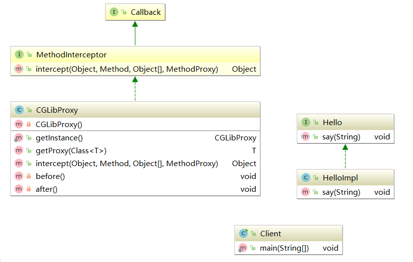

# 代理模式

## 定义

Provide a surrogate or placeholder for another object to control access to it.

为其他对象提供一种代理以控制对这个对象的访问。

代理模式也叫做委托模式。许多其他的模式，如状态模式、策略模式、访问者模式本质上是在更特殊的场合采用了委托模式。在日常的应用中，代理模式可以提供非常好的访问控制。类图中三个角色的定义：

* **Subject抽象主题角色**

  为抽象类或接口，是一个最普通的业务类型定义，无特殊要求。

* **RealSubject具体主题角色**

  也叫被委托角色、被代理角色。是业务逻辑的具体执行者。

* **Proxy代理主题角色**

  也叫做委托类、代理类。它负责把所有抽象主题类定义的方法限制委托给真实主题角色实现，并在真实主题角色处理前后做预处理和善后工作。

## 通用类图

TODO

## 通用源码

抽象主题类

```java
public interface Subject {
    //定义一个方法
    public void request();
}
```

真实主题类

```java
public class RealSubject implements Subject {
    @Override
    public void request() {
        //业务逻辑处理
        System.out.println("业务处理ing");
    }
}
```

代理类

```java
public class Proxy implements Subject {
    //要代理哪个实现类
    private Subject subject = null;

    //默认被代理者
    public Proxy() {
        this.subject = new RealSubject();
    }

   //通过构造函数传递代理者
    public Proxy(Object... objects) {

    }

//    要代理谁就把被代理者传递进来
//    public Proxy(Subject subject) {
//        this.subject = subject;
//    }

    @Override
    public void request() {
        this.before();
        this.subject.request();
        this.after();
    }

    //预处理
    private void before() {
        System.out.println("预处理工作");
    }

    //善后处理
    private void after() {
        System.out.println("善后处理");
    }
}
```

## 优点

* **职责清晰**

  真实的角色就是实现实际的业务逻辑，不用关心其他非本职责的事务，编程简介清晰。

* **高扩展性**

  具体主题角色是随时会发生变化的，但只要它实现了接口，那么代理类就无需修改。

* **智能化**

  以上未体现，但在下面的动态代理会体现出来。

## 使用场景

为什么要使用代理？想想现实生活中打官司为什么要找个律师？我们无需参与中间过程的很多是是非非，只要完成自己的答辩即可，这可以减轻我们的负担。例如Spring AOP就是一个典型的动态代理。

## 代理模式的扩展

### 1. 普通代理

**概述**

在网络上代理服务器设置分为透明代理和普通代理。透明代理就是用户不用设置代理服务器地址，就可以直接访问，代理服务器对用户来说是透明的。普通代理则是需要用户自己设置代理服务器的IP地址，用户必须知道代理的存在。设计模式中的普通代理和强制代理也是类似。普通代理就是我们要知道GamePlayerProxy这个代理类的存在，然后才能访问。强制代理则是调用者直接调用真实角色，而不用关心代理是否存在，其代理的产生是由真实角色决定的。

**普通代理示例源码**

游戏者接口

```java
public interface IGamePlayer {
    //登录游戏
    public void login(String user,String password);
    //杀怪
    public void killBoss();
    //升级
    public void upgrade();
}
```

游戏者(在构造函数中传递进来一个IGamePlayer对象，检查谁能创建真实的角色，也可以根据实际情况进行扩展，例如类名必须为Proxy类等)

```java
public class GamePlayer implements IGamePlayer {
    private String name = "";

    //构造函数限制谁能创建对象，并同时传递姓名
    public GamePlayer(IGamePlayer gamePlayer, String name) throws Exception {
        if(gamePlayer == null){
            throw new Exception("不能创建真实角色");
        } else {
            this.name = name;
        }
    }

    @Override
    public void login(String user, String password) {
        System.out.println("登录名为" + user + "的用户" + this.name + "登录成功");
    }

    @Override
    public void killBoss() {
        System.out.println(this.name + "在打怪");
    }

    @Override
    public void upgrade() {
        System.out.println(this.name + "又升了一级");
    }
}
```

代理者（传递一个代理者名称即可代理，调用者只知道代理存在，不用知道代理了谁，系统更加简洁）

```java
public class GamePlayerProxy implements IGamePlayer {
    private IGamePlayer gamePlayer = null;

    //通过构造函数传递要对谁进行代练
    public GamePlayerProxy(String name) {
        try {
            gamePlayer = new GamePlayer(this, name);
        } catch (Exception e) {
            //异常处理
        }
    }

    //代练登录
    @Override
    public void login(String user, String password) {
        this.gamePlayer.login(user, password);
    }

    //代练杀怪
    @Override
    public void killBoss() {
        this.gamePlayer.killBoss();
    }

    //代练升级
    @Override
    public void upgrade() {
        this.gamePlayer.upgrade();
    }
}
```

场景类

```java
public class Client {
    public static void main(String[] args) {
        //定义一个代练者
        IGamePlayer proxy = new GamePlayerProxy("小三");
        proxy.login("xiaosan","password");
        proxy.killBoss();
        proxy.upgrade();
    }
}
```

运行结果

```shell
登录名为xiaosan的用户小三登录成功
小三在打怪
小三又升了一级
```

**总结**

该模式下，调用者只知代理而不用知道真实的角色是谁，屏蔽了真实角色的变更对高层模块的影响。只要你实现了接口，真实的主题角色修改对高层次的模块没有任何影响。该模式非常适合对扩展性要求较高的场合。当然，在实际的项目中，一般通过约定禁止new一个真实的角色，这也是一个很好的方案。

> 普通代理模式的约束问题，尽量通过团队内的编程规范约束，而不是使用技术约束。

### 2.强制代理


### 3.代理是有个性的


### 4.虚拟代理

只要把代理模式的通用代码稍微修改一下即可。在需要的时候才初始化主题对象，可以避免被代理对象较多而引起的初始化缓慢的问题。其缺点是需要在每个方法中判断主题对象是否被创建。

虚拟代理类

```java
public class Proxy implements Subject {
    //要代理哪个实现类
    private Subject subject;

    @Override
    public void request() {
        //判断一下真实主题是否初始化
        if(subject == null) {
            subject = new RealSubject();
        }
        subject.request();
    }
}
```

### 5.动态代理

**概述**

动态代理是在实现阶段不用关心代理谁，而在运行阶段才指定代理哪一个对象。相对来说，自己写代理类的方式就是静态代理。InvocationHandler是JDK提供的动态代理接口，对被代理类的方法进行代理。其中invoke()方法必须实现，它完成对真实方法的调用。

#### JDK动态代理

游戏者接口

```java
public interface IGamePlayer {
    //登录游戏
    public void login(String user, String password);
    //杀怪
    public void killBoss();
    //升级
    public void upgrade();
}
```

游戏者

```java
public class GamePlayer implements IGamePlayer {
    private String name = "";

    public GamePlayer(String name) {
        this.name = name;
    }

    @Override
    public void login(String user, String password) {
        System.out.println("登录名为" + user + "的用户" + this.name + "登录成功");
    }

    @Override
    public void killBoss() {
        System.out.println(this.name + "在打怪");
    }

    @Override
    public void upgrade() {
        System.out.println(this.name + "又升了一级");
    }
}
```

动态代理类

```java
public class GamePlayIH implements InvocationHandler {
    //被代理者
    Class cls = null;
    //被代理的实例
    Object object = null;
    //我要代理谁
    public GamePlayIH(Object object) {
        this.object = object;
    }

    //调用被代理的方法
    @Override
    public Object invoke(Object proxy, Method method, Object[] args) throws Throwable {
        Object result = method.invoke(this.object, args);
        return result;
    }
}
```

场景类

```java
public class Client {
    public static void main(String[] args) {
        //定义一个痴迷的玩家
        IGamePlayer player = new GamePlayer("张三");
        //定义一个Handler
        InvocationHandler handler = new GamePlayIH(player);
        //获得类的class loder
        ClassLoader classLoader = player.getClass().getClassLoader();
        //动态产生一个代理者
        IGamePlayer proxy = (IGamePlayer) Proxy.newProxyInstance(classLoader, new Class[]{IGamePlayer.class}, handler);
        proxy.login("zhangshan", "password");
        proxy.killBoss();
        proxy.upgrade();
    }
```

现在我们加一个功能：如果想让游戏者登陆后发一个信息给我们，直接修改GamePlayer不是以一个好方法，我们可以这么做：

```java
public class GamePlayIH implements InvocationHandler {
    //被代理者
    Class cls = null;
    //被代理的实例
    Object object = null;
    //我要代理谁
    public GamePlayIH(Object object) {
        this.object = object;
    }

    //调用被代理的方法
    @Override
    public Object invoke(Object proxy, Method method, Object[] args) throws Throwable {
        Object result = method.invoke(this.object, args);
        //如果是登录方法，则发送信息
        if("login".equalsIgnoreCase(method.getName())) {
            System.out.println("有人在用我的账号登录！");
        }
        return result;
    }
}
```

这就是AOP编程原理，对于日志、事务、权限等都可以在系统设计阶段不用考虑，而在设计后通过AOP的方式切过去。下面看看通用动态代理模型的类图：

TODO

两条独立发展的线路，动态代理实现代理的职责，业务逻辑Subject实现相关的逻辑功能，两者之间没有必然的互相耦合的关系。通知Advice从另一个切面切入，最终在高层模块即Client进行耦合，完成逻辑的封装任务。代码实现如下：

抽象主题

```java
public interface Subject {
    //业务操作
    public void doSomething(String string);
}
```

真实主题

```java
public class RealSubject implements Subject{
    @Override
    public void doSomething(String string) {
        System.out.println("do somethig!---->" + string);
    }
}
```

动态代理的Handler类

```java
public class MyInvocationHandler implements InvocationHandler {
    //被代理的对象
    private Object target = null;

    public MyInvocationHandler(Object target) {
        this.target = target;
    }

    @Override
    public Object invoke(Object proxy, Method method, Object[] args) throws Throwable {
        //执行被代理的方法
        return method.invoke(this.target,args);
    }
}
```

动态代理类

```java
public class DynamicProxy<T> {
    public static <T> T newProxyInstance(ClassLoader loader, Class<?>[] interfaces, InvocationHandler handler) {
        //寻找JoinPoint连接点，AOP框架使用元数据定义
        if(true) {
            //执行一个前置通知
            (new BeforeAdvice()).exec();
        }
        //执行目标，并返回结果
        return (T) Proxy.newProxyInstance(loader, interfaces, handler);
    }
}
```

通知接口及实现

```java
public interface IAdvice {
    //通知只有一个方法，执行即可
    public void exec();
}
```

```java
public class BeforeAdvice implements IAdvice {
    @Override
    public void exec() {
        System.out.println("我是前置通知，我被执行了！");
    }
}
```

场景类

```java
public class Client {
    public static void main(String[] args) {
        //定义一个主题
        Subject subject = new RealSubject();
        //定义一个Handler
        InvocationHandler handler = new MyInvocationHandler(subject);
        /*
            参数1：类加载器
            参数2：该实现类的所有接口
            参数3：动态代理对象（InvocationHandler）
         */
        Subject proxy = DynamicProxy.newProxyInstance(subject.getClass().getClassLoader(), subject.getClass().getInterfaces(), handler);
        //代理的行为
        proxy.doSomething("Finish");
    }
}
```

运行结果

```
我是前置通知，我被执行了！
do somethig!---->Finish
```

在DynamicProxy类中，有这样的语句

```java
Subject proxy = DynamicProxy.newProxyInstance(subject.getClass().getClassLoader(), subject.getClass().getInterfaces(), new MyInvocationHandler(subject));
```

该方法重新生成了一个对象，subject.getClass().getInterfaces()是说查找该类的所有接口，然后实现接口的所有所有方法，当然方法都是空的，然后由new MyInvocationHandler(subject)这个对象负责接管。于是我们知道一个类的动态代理类是这样的一个类，由InvocationHandler的实现类实现所有的方法，由其invoke方法接管所有方法的实现，其动态调用过程如图：


由于DynamicProxy类是一个通用类，不具有业务意义，所以我们可以再产生一个子类来扩展，使得高层模块对代理的访问会更加简单。

```java
public class SubjectDynamicProxy extends DynamicProxy {
    public static <T> T newProxyInstance(Subject subject) {
        //获得ClassLoder
        ClassLoader classLoader = subject.getClass().getClassLoader();
        //获得接口数组
        Class<?>[] interfaces = subject.getClass().getInterfaces();
        //获得handler
        InvocationHandler handler = new MyInvocationHandler(subject);
        return newProxyInstance(classLoader,interfaces,handler);
    }
}
```

场景类

```java
public class Client {
    public static void main(String[] args) {
        //定义一个主题
        Subject subject = new RealSubject();
        //定义主题的代理
        Subject proxy = SubjectDynamicProxy.newProxyInstance(subject);
        //代理的行为
        proxy.doSomething("Finish");
    }
}
```

那么这样和静态代理有什么区别？都是需要实现一个代理类。注意看父类，动态代理的主要意图是横切面编程，是在不改变我们已有代码结构的情况下增强或控制对象的行为。

**注意**

JDK动态代理的首要条件是被代理类必须实现一个接口，当然像CGlib可以实现不需要接口也可以实现动态代理的方式。

#### CGlib动态代理

JDK动态代理只有代理有接口的类，而无法代理没有接口的类。利用CGlib可以动态代理没有接口的类。CGlib这个类库是一个在运行期间动态生成字节码的工具，也就是动态生成代理类。

CGLibProxy.java

```java
package com.woodpecker.czq;

import net.sf.cglib.proxy.Enhancer;
import net.sf.cglib.proxy.MethodInterceptor;
import net.sf.cglib.proxy.MethodProxy;

import java.lang.reflect.Method;

/**
 * @author: woodpecker
 * @Date: 2018/7/16 1:43
 */
public class CGLibProxy implements MethodInterceptor {
    public <T> T getProxy(Class<T> cls){
        return (T) Enhancer.create(cls,this);
    }

    @Override
    public Object intercept(Object object, Method method, Object[] args, MethodProxy methodProxy) throws Throwable {
        before();
        Object result = methodProxy.invokeSuper(object,args);//方法级别的代理
        after();
        return result;
    }
    private void before(){
        System.out.println("Before");
    }
    private void after(){
        System.out.println("After");
    }
}

```

Client.java

```java
package com.woodpecker.czq;

import java.lang.reflect.Proxy;

/**
 * @author: woodpecker
 * @Date: 2018/7/16 0:34
 */
public class Client {
    public static void main(String[] args) {
        CGLibProxy cgLibProxy = new CGLibProxy();
        Hello helloProxy = cgLibProxy.getProxy(HelloImpl.class);
        helloProxy.say("小强");
    }
}

```

运行，输出结果与之前一致。

每次返回代理对象需要new一次CGLibProxy，使用单例模式改进一下

CGLibProxy.java

```java
package com.woodpecker.czq;

import net.sf.cglib.proxy.Enhancer;
import net.sf.cglib.proxy.MethodInterceptor;
import net.sf.cglib.proxy.MethodProxy;

import java.lang.reflect.Method;

/**
 * @author: woodpecker
 * @Date: 2018/7/16 1:43
 */
public class CGLibProxy implements MethodInterceptor {
    private static CGLibProxy instance = new CGLibProxy();

    private CGLibProxy(){}

    public static CGLibProxy getInstance(){
        return instance;
    }

    public <T> T getProxy(Class<T> cls){
        return (T) Enhancer.create(cls,this);
    }

    @Override
    public Object intercept(Object object, Method method, Object[] args, MethodProxy methodProxy) throws Throwable {
        before();
        Object result = methodProxy.invokeSuper(object,args);//方法级别的代理
        after();
        return result;
    }
    private void before(){
        System.out.println("Before");
    }
    private void after(){
        System.out.println("After");
    }
}

```

Client.java

```java
package com.woodpecker.czq;

import java.lang.reflect.Proxy;

/**
 * @author: woodpecker
 * @Date: 2018/7/16 0:34
 */
public class Client {
    public static void main(String[] args) {
        Hello helloProxy = CGLibProxy.getInstance().getProxy(HelloImpl.class);
        helloProxy.say("小强");
    }
}

```

类图：



## 最佳实践

代理模式应用十分广泛，有类型Spring AOP和AspectJ这样优秀的工具，拿来用即可。工作开发过程中，如果不是现有框架不符合需求，无须重复造轮子。