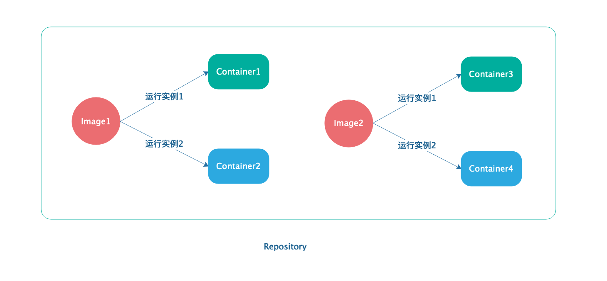

 # Docker

## Basic

### 三大核心概念

1. Image：类似虚拟机镜像，可以理解为`只读模板`
2. Container：类似于一个轻量级sandbox，Container是从Image创建的`应用运行实例`
3. Repository：类似代码仓库，是`Docker集中存放镜像的场所`



## Use Image

### 获取镜像

```shell
# 不指定TAG默认为latest,表示最新版本
docker [image] pull NAME[:TAG]
```

### 查看镜像信息

```shell
#列出本地主机上已有镜像的基本信息
#方式1
docker images
#方式2
docker image ls
```

### 为本地镜像添加标签

```shell
#新建了一个myubuntu:lastet标签  标签的作用类似链接
docker tag ubuntu:lastet myubuntu:lastet
```

### 搜索镜像

```shell
docker search [option] keyword
#example
docker search --filter=is_official=true nginx
```

options:

* -f, —filter filter:过滤输出内容
* —format string:格式化输出内容
* —no-trunc:不截断输出结果

### 删除镜像

```shell
#方式1
docker rmi IMAGE [IMAGE...]
#方式2
docker image rm IMAGE [IMAGE...]
#example
docker rmi myubuntu:lastet
```

其中，IMAGE可以为标签或ID。

当使用`标签`删除镜像，并且该镜像拥有多个标签时，该命令指示删除了指定的标签，不会删除镜像文件本身。只有当该镜像只有一个标签时才会删除该镜像文件的所有文件层。

当使用`镜像ID`删除镜像时，docker会尝试删除所有指向该镜像的标签，然后删除该镜像文件本身。

### 清理镜像

使用docker一段时间后，系统中可能会遗留一些临时的镜像文件以及一些没有被使用的镜像，可以使用prune命令来进行清理。

```shell
docker image prune
```

### 创建镜像

有三种方法可以创建镜像：

1. 基于已有镜像的容器创建
2. 基于本地模板导入
3. 基于Dockerfile创建

#### 基于已有镜像的容器创建

主要命令：

```shell
docker [container] commit [OPTIONS] CONTAINER [REPOSITORY[:TAG]]
```

例子：

``` shell
# 创建并运行一个Container
docker run -it ubuntu:latest /bin/bash
touch test
exit

# 使用该命令查看Container ID，得到的是2ffcbfe4f063
docker ps -a
# 该命令会返回新创建镜像的ID信息
docker commit -m "Added test file" -a "ddm" 2ffcbfe4f063 test:0.1
# 此时查看本地镜像列表，会发现新创建的镜像已经存在
docker images
```

#### 基于本地模板导入

略

### 基于Dockerfile创建

略

### 存出和载入镜像

#### 存出镜像

可以使用docker save命令将镜像保存到本地文件，方便将镜像分享给他人

```
docker save -o ubuntu_latest.tar ubuntu:latest
```


### deploy frontend project with docker

- add nginx.conf

  ```nginx
  #important clip
  location / {
    root   /usr/share/nginx/html;
    index  index.html index.htm;
    try_files $uri $uri/ /index.html;
  }
  ```

- customer image

  ```dockerfile
  #Dockerfile
  FROM nginx:1.17.8
  LABEL maintainer "czq.woodpecker@qq.com"
  ADD ./dist/ /usr/share/nginx/html/
  ADD nginx.conf /etc/nginx/
  EXPOSE 80
  ```

- build image

  ```
  #woodpecker/test is the tag, . means it will use current directory Dockerfile
  docker build -t woodpecker/test .
  ```

- run

  ```
  #8080:80 means mapping host port 8080 to docker host port 80
  docker run -d -p 8080:80 woodpecker/test
  ```

  

