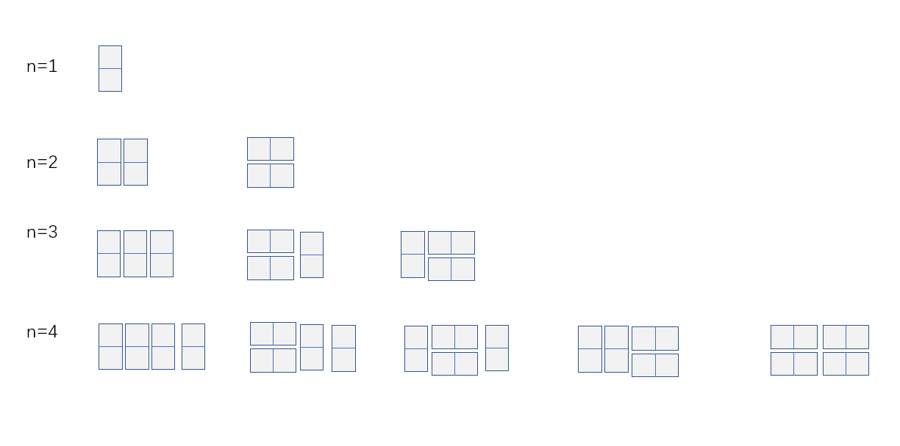

## 题目描述

我们可以用2**1的小矩形横着或者竖着去覆盖更大的矩形。请问用n个2*1的小矩形无重叠地覆盖一个2*n的大矩形，总共有多少种方法？

## 思路





其实，倒数第一列要么就是1个2**1的矩形竖着放，要么就是2个横着放的。如果是竖着放的，那么剩下的就是n-1个小矩形，放法是F(n-1)种；如果是横着放的，放法就是F*(n-2)。

这样子看，其实这个就是前面的跳台阶问题。

那么就同样有三种解法，此处只写出一种。

若n==1,则返回1；

若n==2,则返回2；

否则，返回F（n-1）+ F（n-2）

## 代码

```java
public class Solution {
    public int RectCover(int target) {
        if(target <= 2){
            return target;
        }else{
            return RectCover(target-1)+RectCover(target-2);
        }
    }
}
```

