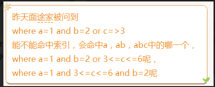

> MySQL 5.5 InnoDB

**表结构**

**建表语句**

**联合索引字段：**
KEY `name` (`name`,`age`,`status`)

| 序号 | 字段名 | 类型    |
| ---- | ------ | ------- |
| 1    | name   | char    |
| 2    | age    | tinyint |
| 3    | status | tinyint |

> 参考：
>
> https://www.jianshu.com/p/c627f060e542

explain结果中各个字段的含义

切换引擎