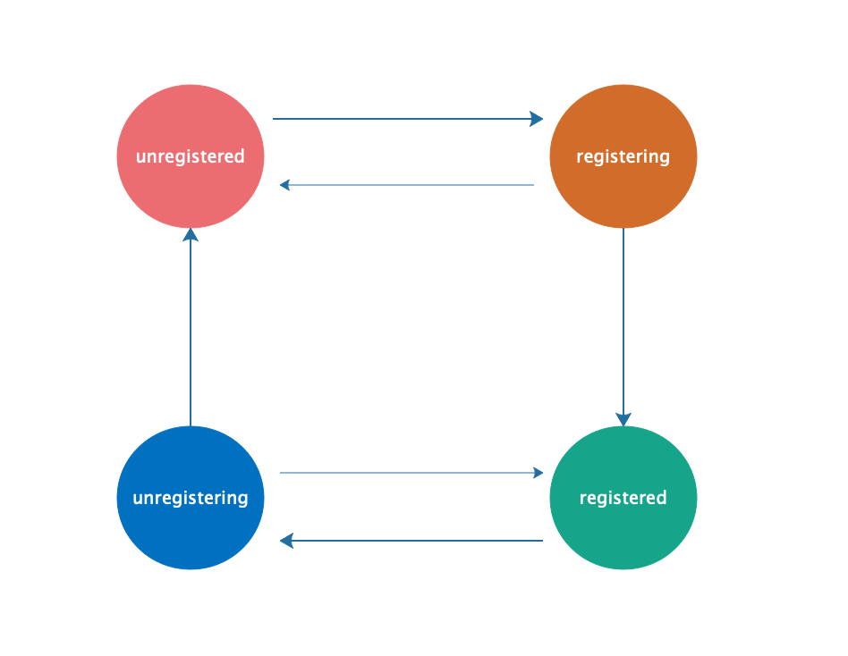

# 状态机

关于状态机的初步了解可以查看[FPGA状态机](https://blog.csdn.net/Reborn_Lee/article/details/84632934)

## 情景

账户的状态变化如下图，请用状态机实现。



### 思路

状态一共有4种，每个状态最多进行两种状态转移（最多往两个方向变化），为了方便，我们把状态在这两个方向上的变化称为forward和revert。

```typescript
enum AccountStatus {
  UNREGISTERED = 'UNREGISTERED',
  REGISTERING = 'REGISTERING',
  REGISTERED = 'REGISTERED',
  UNREGISTERING = 'UNREGISTERING',
}

export const AccountStatusMachine = {
  [AccountStatus.UNREGISTERED]: {
    foward: () => AccountStatus.REGISTERING,
    revert: () => {},
  },
  [AccountStatus.REGISTERING]: {
    forward: () => AccountStatus.REGISTERED,
    revert: () => AccountStatus.UNREGISTERED,
  },
  [AccountStatus.REGISTERED]: {
    forward: () => AccountStatus.UNREGISTERING,
    revert: () => {},
  },
  [AccountStatus.UNREGISTERING]: {
    forward: () => AccountStatus.UNREGISTERED,
    revert: () => AccountStatus.REGISTERED,
  },
}

const preAccountStatus = 'UNREGISTERING'
const direction = 'forward'
const newAccountStatus = AccountStatusMachine[preAccountStatus][direction]()
console.log(newAccountStatus)
console.log(AccountStatusMachine[preAccountStatus]['revert']())
```

> [TypeScript在线编译运行工具](https://c.runoob.com/compile/5577)