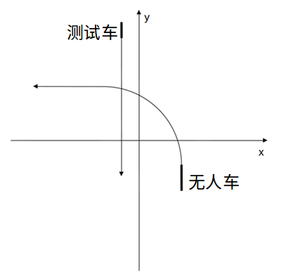

## 碰撞检测

题目描述
> Pony的工程师们在编写自动驾驶代码时经常需要考虑的问题就是无人车是否会跟其他车相撞。考虑在一个十字路口处，无人车由南向西左转，而此时有测试车由北向南直行，你能否帮助Pony的工程师们编写程序判断两车是否会发生相撞呢？
>
> 为了使问题足够简化，我们假设无人车车长为l0，全程以速度v0匀速行驶。测试车车长l1，全程以速度v1匀速行驶。假设x轴正方向为东，y轴正方向为北。假设当前时刻无人车车头位于(x0, y0)，朝向正北，无人车即将开始划过一个半径为r的1/4圆弧后笔直朝西行驶。当前时刻测试车车头位于(x1, y1)，朝向正南（x1 < x0）。假设无人车和测试车宽度为0，行驶过程中永远是完全贴住轨迹的长度为其车长的线段或弧线段。如下图所示。
>
> 

输入
> 第一行是一个整数n，表示共有n组数据。
> 
> 接下来共n行，每行是用空格隔开的7个整数，分别为l0, v0, l1, v1, x0, y0, r, x1, y1。
> 
> n <= 10，1 <= l0, l1 <= 20，1 <= v0, v1 <= 50，坐标范围和r均在[0, 10000]间。输入数据保证不会出现边界情况，即无论答案是什么，无人车早出发0.001秒或晚出发0.001秒均不会影响答案。

输出
> 共n行，每行输出Yes（表示会发生碰撞）或No（表示不会发生碰撞）。

样例输入
>2  
5　10　6　15　10　0　10　-1　40  
5　10　6　15　10　0　10　1　40  

样例输出
> Yes  
No

