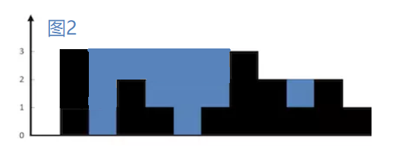

## 升级蓄水池
题目描述
> 在米兔生活的二维世界中，建造蓄水池非常简单。
>
> 一个蓄水池可以用n个坐标轴上的非负整数表示，代表区间为【0-n】范围内宽度为1的墙壁的高度。
>
> 如下图1，黑色部分是墙壁，墙壁的高度是[0，1，0，2，1，0，1，3，2，1，2，1] ，蓝色部分是蓄水的面积，可以看出蓄水池最大蓄水容量是6。
>
> 
>
> 现在米兔想通过增加某些墙壁的高度对蓄水池扩容，但是经费有限，最多只能增加最多m的高度，增加高度只能在【0-n】范围内，高度为0的区域也是可以增加的，为了追求最大的性价比，米兔想要找到一种最优方案，使扩容后蓄水池的容量最大，你能帮帮他么？
>
> 提示：
> 对于样例，图2，图3，是样例可能的两种扩容方案，显然图2是比图3更优的方案
> 关于题目数据范围 
> 20%的数据， n<10,m<10,蓄水池最大高度小于10
> 50%的数据， n<100,m<100,蓄水池最大高度小于100
> 100%的数据， n<1000,m<1000,蓄水池最大高度小于1000

输入
> 第一行为一个数字n
> 
> 接下来n行，每行一个数字，代表n个墙壁的高度
> 
> 最后一行为一个数字m

输出
> 一个数字，表示扩容之后蓄水池能达到的最大容量

样例输入
>12   
0   
1   
0   
2   
1   
0   
1   
3   
2   
1   
2   
1  
2

样例输出

> 12